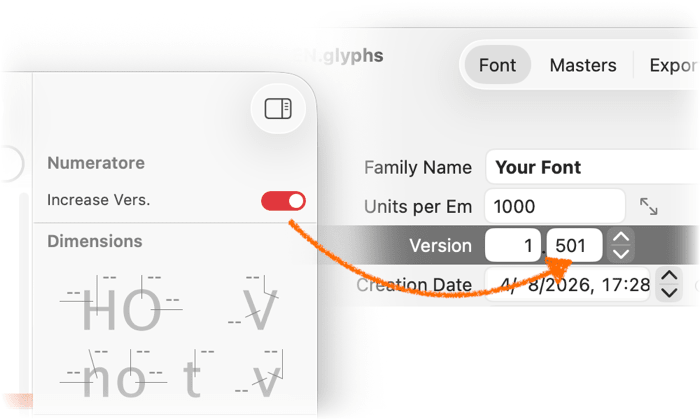

# 🔢 Numeratore

By Giuseppe Salerno co-founder of [Resistenza Type](https://rsztype.com).

This is a plugin for the [Glyphs font editor](https://glyphsapp.com/). It automatically increases the font version by `0.001` every time you export, so each exported file carries a unique, incrementing version number without any manual step.

After installation, it adds two switches to the palette area on the right (the Inspector). With **Increase Vers.** on, every export increments `versionMinor` in *Font Info > Font*, saves the `.glyphs` file, and shows a notification with the new version. With **Add vers. in filename** on, every file the export just wrote — OTF, TTF, WOFF, WOFF2 — is renamed with that same version on the end — `Nautica.otf` becomes `Nautica-1.023.otf` — using the number the `.glyphs` file carried at the moment of the export, which is the number inside the exported font; the increase, when it is switched on, belongs to the next export. Every instance of a family export is named with the same number, and exporting the same version twice replaces the file instead of piling numbers on the name. Either switch works without the other, and both are remembered between launches.



> **Previously released as “Version Bumper”.** If you had that version installed, remove it (Plugin Manager, or delete `Version-Bumper.glyphsPalette` from your Plugins folder) so you don't end up with two palettes. The switch starts off again after the rename.

### Installation

1. Unzip the download and double-click `Numeratore.glyphsPalette` — Glyphs will offer to install it. (Alternatively, drop it into `~/Library/Application Support/Glyphs 3/Plugins/` or `~/Library/Application Support/Glyphs 4/Plugins/`.)

2. Restart Glyphs.app.

### Usage Instructions

1. Open a font, and find the *Numeratore* panel in the Inspector on the right.
2. Flip the **Increase Vers.** switch on, the **Add vers. in filename** switch, or both.
3. Export as usual (⌘E). The version is bumped by `0.001` after each export.

The increment lands in the source right after export, ready for the next one, so every exported file gets its own distinct, increasing version.

### Options

You can toggle it from the *Macro Panel* (*Window > Macro Panel*) without touching the switch, by running:

```python
Glyphs.defaults["com.rsztype.Numeratore.enabled"] = True
```

Set it to `False` to turn it off. The switch in the palette reflects the same setting.

A 10-second debounce groups a batch of instances into a single increment, so exporting many instances at once still bumps the version only once. A single shared observer handles the bump across all open documents.

### Requirements

The plugin requires Glyphs 3 or Glyphs 4, running on macOS 10.15 or later. The bundle is universal, so it runs natively on both Apple Silicon and Intel. If it does not work for you, please update your app and/or macOS to a newer version.

### License

Copyright 2026 Giuseppe Salerno / Resistenza Type [rsztype.com](https://rsztype.com).

You may use, modify, and distribute this plugin freely. It is provided as-is, without warranty of any kind.
